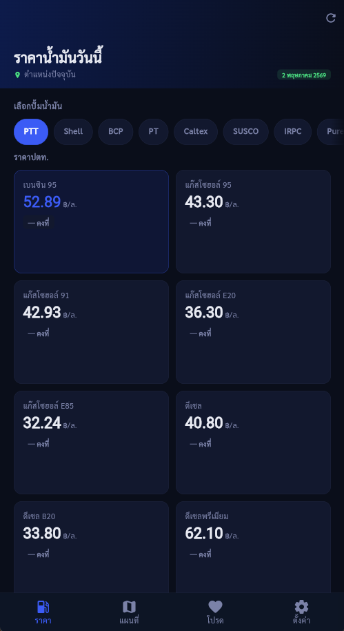
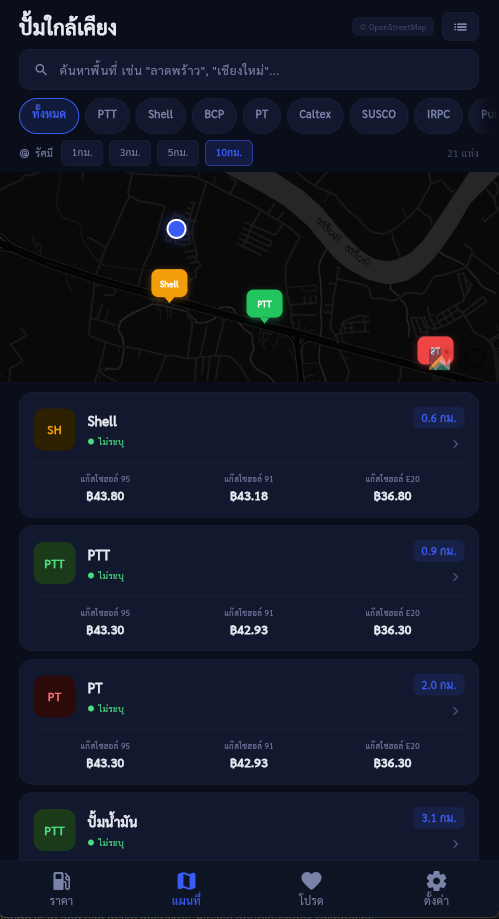
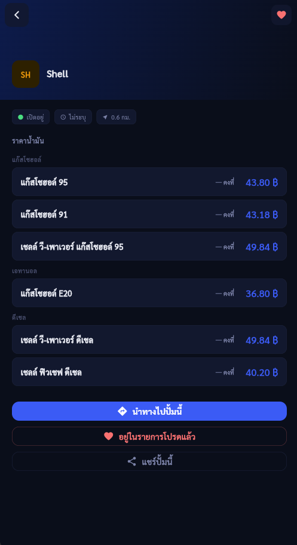

# ⛽ Fuel_TH — แอพตรวจสอบราคาน้ำมัน

## 🗺️ ตัวอย่าง UI

<div align="center">
  <table>
    <tr>
      <td></td>
      <td></td>
      <td></td>
      <td></td>
    </tr>
  </table>
  <em>📍 หน้าหลัก · ราคาน้ำมัน · แผนที่ค้นหาปั้ม · รายละเอียดและนำทาง</em>
</div>

---

<div align="center">

  <br>
  <p>
<p align="center"> 
<a href="https://flutter.dev">  </a> 
<a href="https://dart.dev">  </a> 
<a href="https://www.openstreetmap.org">  </a> 
<br> <strong>📍 รู้ราคาน้ำมันจริงรายวัน · 🔍 ค้นหาปั้มใกล้คุณด้วย OpenStreetMap</strong> </p>
  </p>
  <p>
    <a href="#-features">✨ Features</a> |
    <a href="#-apis">📡 APIs</a> |
    <a href="#-project-structure">📁 Project structure</a> |
    <a href="#-installation">🚀 Installation</a>
  </p>
</div>

---

## ✨ Features

- ✅ ราคาน้ำมันจาก Thai Oil API (ข้อมูลจริงรายวัน)
- ✅ เลือกปั้ม: PTT, Shell, BCP, PT, Caltex, SUSCO, IRPC, Pure
- ✅ แผนที่ Dark Theme (CartoDB Dark Matter)
- ✅ ค้นหาปั้มใกล้เคียงด้วย Overpass API
- ✅ ค้นหาพื้นที่ด้วย Nominatim geocoding
- ✅ เลือกรัศมี 1/3/5/10 กม.
- ✅ กรองตามแบรนด์
- ✅ Custom Map Pin สีแยกตามแบรนด์
- ✅ แตะ Pin บนแผนที่ → เปิด detail
- ✅ นำทางผ่าน Google Maps / Apple Maps
- ✅ Cache 30 นาที

---

## 📡 APIs 

| API                                                       | ใช้สำหรับ             |     ค่าใช้จ่าย      |   สถานะ    |
| :-------------------------------------------------------- | :----------------- | :--------------: | :--------: |
| [Thai Oil API](https://api.chnwt.dev/thai-oil-api/latest) | ราคาน้ำมันประจำวัน      |       🇹🇭 ฟรี       |  ✅ Stable  |
| [Overpass API](https://overpass-api.de)                   | ค้นหาปั้มรอบรัศมี       |       🌍 ฟรี       |    ✅ ดี     |
| [Nominatim](https://nominatim.openstreetmap.org)          | Geocoding (ชื่อ→พิกัด) | 🌍 ฟรี (ขอ credit) | ✅ จำกัด rate |
| [CartoDB](https://carto.com)                              | แผนที่ Dark Theme    |       🌍 ฟรี       | ✅ ใช้งานง่าย |

---

## 📁 Project structure 

โปรเจคใช้ **Provider** เป็น state management และแยก service อย่างชัดเจน

```bash
lib/
├── main.dart                     # จุดเริ่มต้น + MultiProvider
├── theme/
│   └── app_theme.dart            # Dark theme & color schemes
├── models/
│   └── fuel_model.dart           # FuelPrice, Station model
├── services/
│   ├── fuel_service.dart         # Thai Oil API (cache 30 นาที)
│   ├── places_service.dart       # Overpass API + Nominatim
│   └── app_provider.dart         # Provider state (ราคา, สถานี, แผนที่)
├── screens/
│   ├── home_screen.dart          # หน้าแรก + ตารางราคาน้ำมัน
│   ├── nearby_screen.dart        # OSM Map + รัศมี + กรองแบรนด์
│   └── station_detail_screen.dart # รายละเอียดปั้ม + ปุ่มนำทาง
└── widgets/
    └── common_widgets.dart       # Loading, Error, Custom Pin
```

## 🚀 Installation

```bash
flutter pub get
flutter run
```

---
<p align="center"> <strong>Made with Flutter & OpenStreetMap</strong>
<br><strong> Developed by <a href="https://www.facebook.com/saharat.suwannapapond.7/">Sarus</a></strong> ⭐ อย่าลืมกดดาว Github ถ้าชอบโปรเจคนี้! </p>